# 动画梯度排行 · 使用手册

动画梯度排行是一款在电脑上给动画「排座次」的小工具：建一份榜单，把看过的动画放进 **夯、顶级、人上人、NPC、拉完了、无关心** 六个等级，最后导出成一张图片分享出去。所有数据都保存在你自己的电脑上，不需要注册账号。

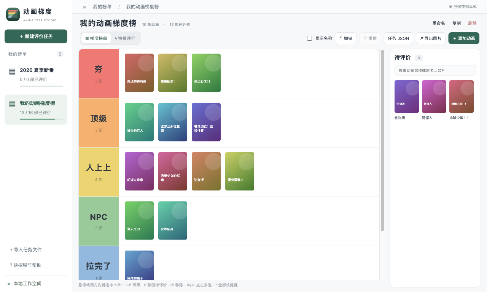

**目录**

- [五分钟上手](#五分钟上手)
- [添加动画](#添加动画)
- [给动画评级](#给动画评级)
- [整理榜单](#整理榜单)
- [管理多份榜单](#管理多份榜单)
- [导出与备份](#导出与备份)
- [快捷键一览](#快捷键一览)
- [常见问题](#常见问题)

---

## 五分钟上手

**1. 创建榜单。** 第一次打开时，点击页面中间的 **＋ 创建第一份评价任务**，输入榜单名称后点 **保存**。以后想再建一份，点左上角的 **＋ 新建评价任务** 即可。

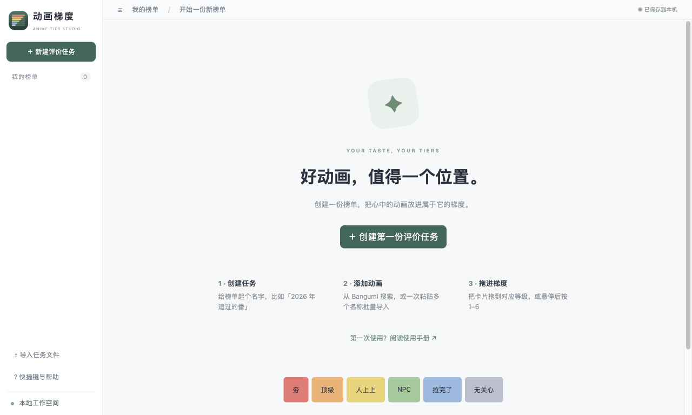

> 小技巧：在名称框里每行写一个名字，可以一次建好多份榜单。

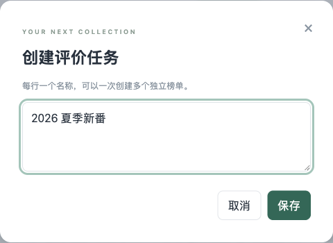

**2. 添加动画。** 点击右上角的 **＋ 添加动画**，在搜索框输入动画名称，勾选想要的结果，再点 **加入榜单 →**。新加入的动画会出现在右侧的 **待评价** 区。

**3. 评级。** 用鼠标把右侧的卡片拖到左边对应的等级里就完成了评级。也可以把鼠标停在卡片上，直接按数字键 **1–6**（1 是「夯」，6 是「无关心」）。

**4. 导出图片。** 点击右上角的 **↗ 导出图片**，确认预览后点 **保存图片**。

所有改动都会自动保存，右上角显示「已保存到本机」就说明已经存好了。

---

## 添加动画

点击 **＋ 添加动画** 打开侧栏。侧栏顶部写着「加入榜单：…」，表示这次添加的动画会进入哪份榜单。一共有五种添加方式：

| 方式     | 适合什么时候用                                       |
| -------- | ---------------------------------------------------- |
| 搜索     | 知道名字，想找某一部                                 |
| 季度     | 想把某一季的新番一次性都加进来                       |
| 批量名称 | 手上有一份片单，想一次导入                           |
| 手动     | 搜不到、没有网络，或者想自己填写信息                 |
| 收藏     | 你在 [Bangumi 番组计划](https://bgm.tv) 上有收藏记录 |

### 搜索

输入中文名或原名，按回车或点 **搜索动画**。点击结果可以勾选或取消勾选，可以一次勾选多部；**选择已加载** 会勾选当前列出的全部结果，结果较多时可以点底部的 **加载更多**。

已经在这份榜单里的动画会显示为灰色，并标注 **已在榜单**，不会被重复添加。

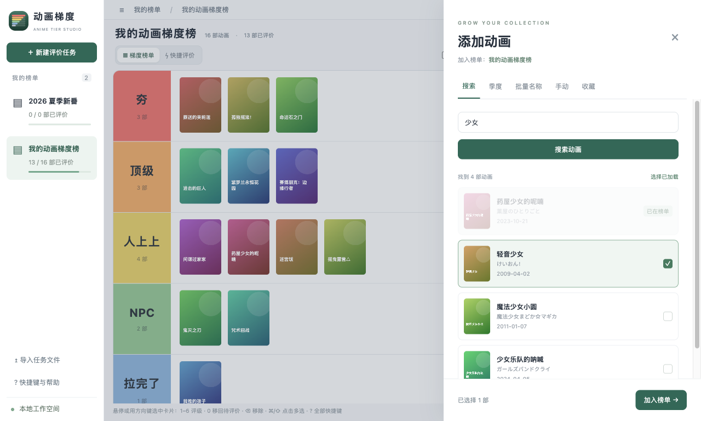

### 季度

选择年份和季度（冬、春、夏、秋），点 **获取季度动画**，然后像搜索一样勾选。

### 批量名称

每行输入一个动画名称，点 **匹配动画名称**。软件会逐个去搜索，并自动为每一行选好最接近的结果。

- 请检查每一行的下拉框，确认选中的是你想要的那一部。
- 没有找到合适的结果时，可以选 **作为手动条目添加**，或者保持 **跳过** 不添加这一行。
- 名字很多时，匹配过程中可以点 **取消匹配**；因为网络原因失败的行，可以点 **重试失败项** 单独重新匹配。

底部的「已确认 N 部」表示将会加入多少部，确认无误后点 **加入榜单 →**。

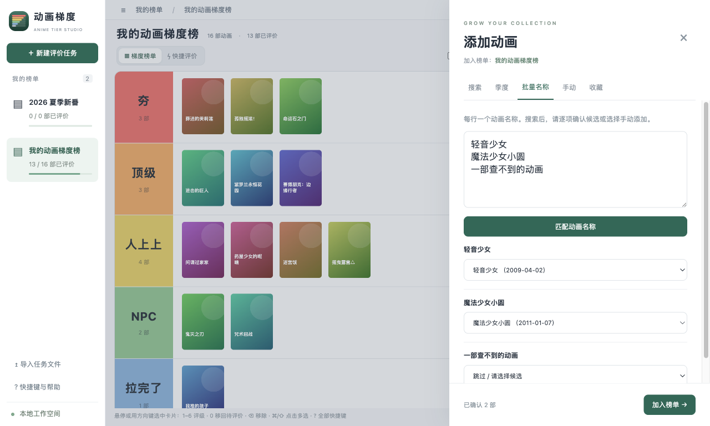

### 手动

填写名称（必填）、原名、首播日期和简介后加入。手动添加的动画没有封面，以后可以在详情里补上，见 [编辑动画信息](#编辑动画信息)。没有网络时也能使用这种方式。

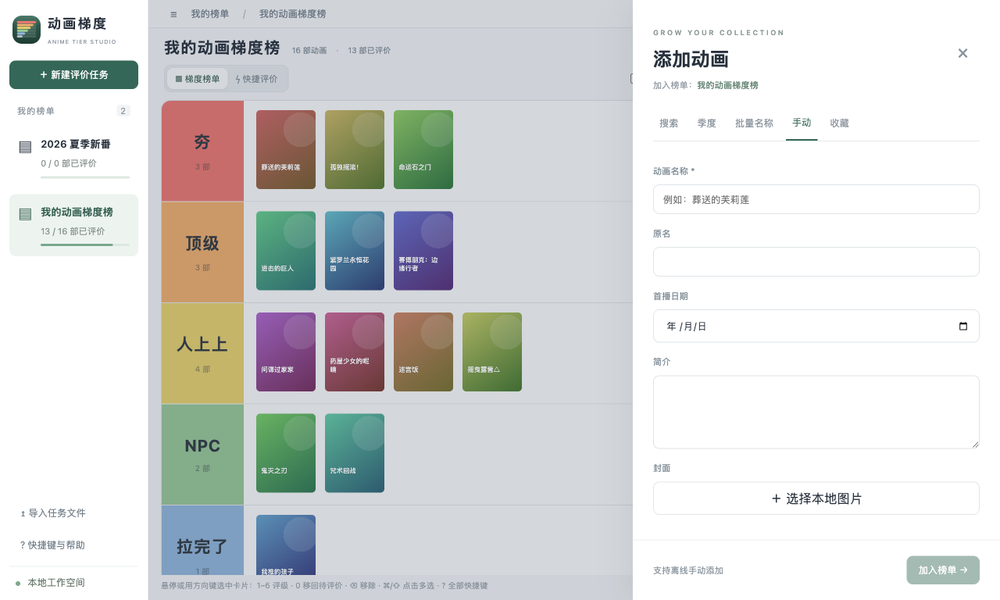

### 收藏

输入你的 Bangumi 用户名或个人主页链接，选择收藏状态（想看、看过、在看、搁置、抛弃），点 **获取公开收藏**。只能读取公开的收藏，不需要登录。

---

## 给动画评级

### 拖拽

把卡片拖到某个等级的行里即可。几个常用的拖法：

- **调整先后顺序**：拖到同一等级里另一张卡片的前面。
- **撤回评级**：把卡片拖回右侧的待评价区。
- **长榜单**：拖到榜单区域的上下边缘时会自动滚动。

### 键盘

鼠标停在卡片上（或者用方向键选中卡片）后：

| 按键  | 作用                                            |
| ----- | ----------------------------------------------- |
| 1 – 6 | 放进 夯 / 顶级 / 人上人 / NPC / 拉完了 / 无关心 |
| 0     | 移回待评价                                      |
| ⌫     | 从榜单移除                                      |

### 快捷评价

待评价的动画很多时，推荐点击左上方的 **快捷评价**（或按 ⌘2）。软件会一部一部地展示封面、原名、首播日期和简介，你只要做选择：

- 点等级按钮，或按数字键 **1–6** 评级，并自动进入下一部。
- 拿不准的按 **S** 或 **→** 跳过，稍后再评。
- 手滑了按 **←** 回到上一部，重新选择。

所有动画都评完后，点 **梯度榜单**（或按 ⌘1、Esc）回到榜单视图。

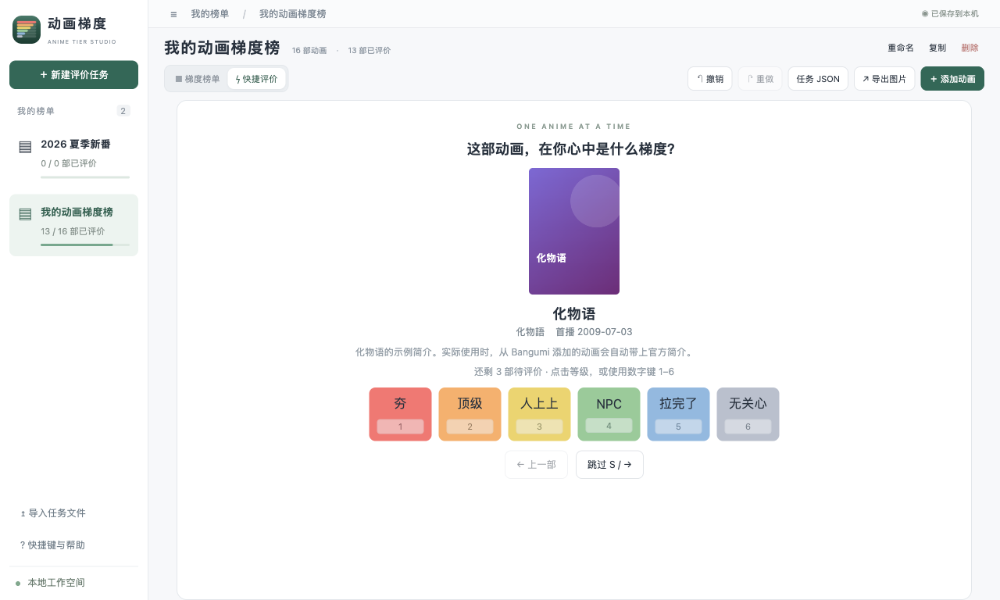

> 「无关心」也算作已评价。它适合放「看过但没什么感觉」的动画。

---

## 整理榜单

### 查看详情

点击任意卡片打开详情。可以在这里看到：

- **动画信息**：简介和首播日期。
- **当前等级**：左上角的标签，对应的等级按钮上也有 ✓。
- **修改等级**：直接点另一个等级按钮。
- **在 Bangumi 查看 ↗**：在浏览器里打开这部动画的页面。
- **从榜单移除**：把这部动画移出榜单。

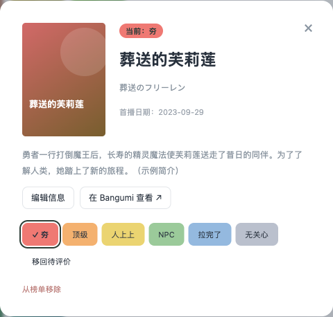

### 编辑动画信息

在详情里点 **编辑信息**，可以修改名称、原名、首播日期和简介。封面有三个按钮：

- **选择本地图片**：用自己电脑上的图片做封面。
- **从 Bangumi 重新获取**：重新下载官方封面和信息，适合封面加载失败的情况。
- **移除封面**：去掉封面，只显示名称。

改完点 **保存**。

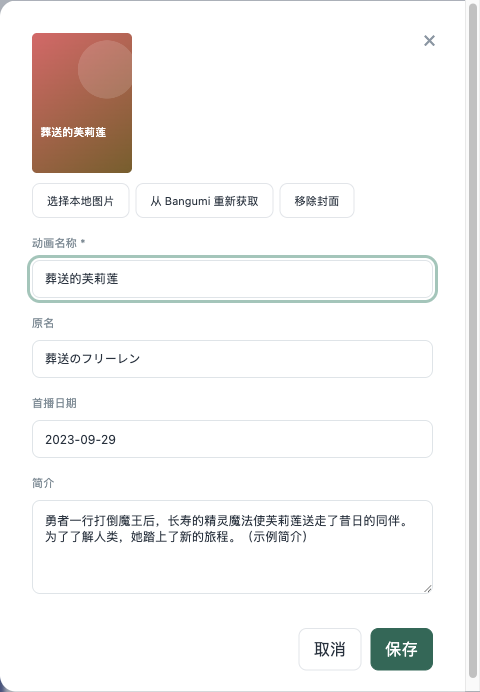

### 一次处理多部

- 按住 **⌘** 点击卡片，逐个选择。
- 按住 **⇧** 点击，选中一段连续的卡片。
- 按 **⌘A** 选中全部。

选中后，底部会出现选择栏：点等级可以一起评级，也可以一起移回待评价或移除。选中的卡片还可以一起拖动，或者按数字键一起评级。在卡片上 **右键** 会弹出同样的菜单。按 **Esc** 取消选择。

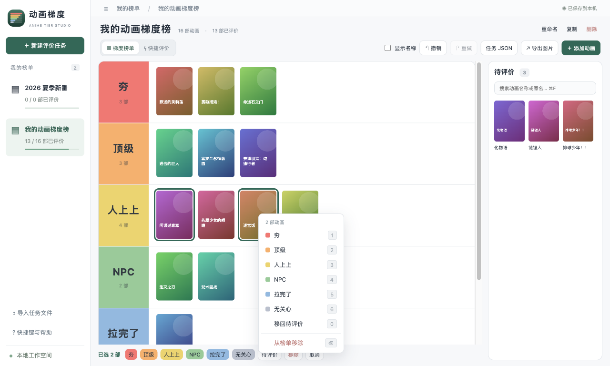

### 搜索榜单

榜单大了找不到某一部时，在右侧待评价区上方的搜索框里输入名称或原名（快捷键 ⌘F），不区分大小写：

- 待评价区只显示匹配的动画。
- 左侧榜单里匹配的卡片会高亮，其余卡片变暗。
- 按回车跳到第一个匹配的卡片，按 Esc 清空搜索。

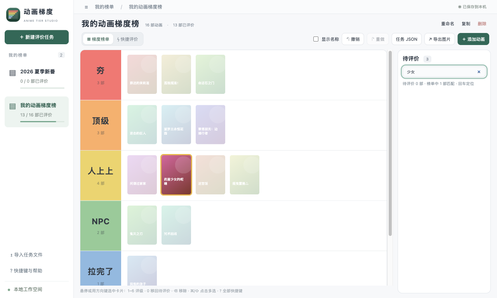

### 显示名称

榜单默认只显示封面。勾选顶部的 **显示名称**，卡片下方会显示动画名称；不勾选时，鼠标停在卡片上也能看到完整名称。

### 撤销与重做

评级、添加、移除、编辑、重命名、删除榜单等几乎所有操作都可以撤销：

- 按 **⌘Z** 撤销，**⇧⌘Z** 重做，也可以点顶部的 **撤销**、**重做** 按钮。
- 操作后底部会弹出提示条，直接点里面的 **撤销** 也可以。鼠标停在提示条上时，它不会自动消失。

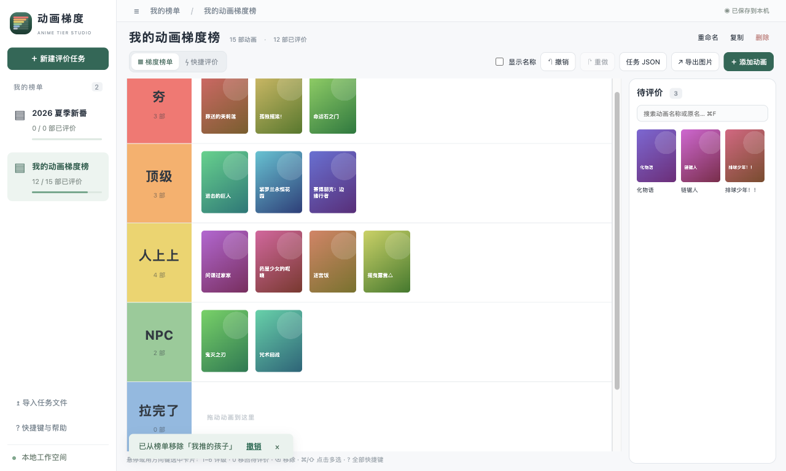

---

## 管理多份榜单

左侧栏列出了所有榜单，以及每份榜单的评价进度，点击即可切换。榜单标题右侧有三个按钮：

- **重命名**：修改榜单名称。
- **复制**：复制出一份一模一样的榜单，适合「在原榜单基础上改一版」。
- **删除**：删除整份榜单。删错了可以马上用提示条里的 **撤销** 或 ⌘Z 找回来。

点击左上角的 **☰** 可以收起或展开左侧栏，给榜单留出更多空间（快捷键 ⌃⌘S）。

---

## 导出与备份

### 导出图片

点击 **↗ 导出图片**（⌘E）会先打开预览，保存的图片和预览看到的一模一样。

- 可以勾选 **显示动画名称**，在图片里加上名称。
- 图片里只包含已评级的动画，待评价的不会出现。
- 榜单很长时会自动分成多张图片，用 **上一页 / 下一页** 翻看。保存时会依次生成 `名称-1.png`、`名称-2.png` 等文件。

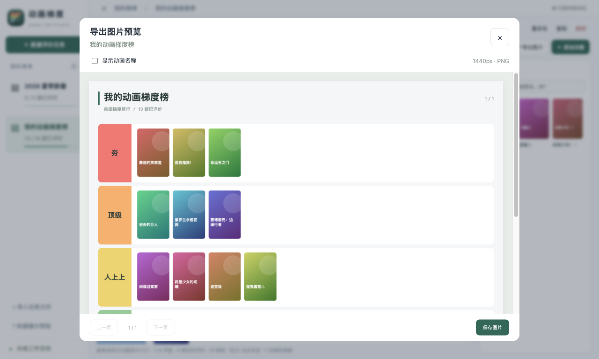

### 备份与分享榜单文件

点击 **任务 JSON**（⇧⌘E）可以把当前榜单保存成一个 `.json` 文件，封面也会一起打包进去。这个文件可以用来：

- **备份**：定期导出一份，放到网盘或其他地方。
- **换电脑**：在新电脑上点左侧栏的 **↥ 导入任务文件**（⌘O）导入。
- **分享给朋友**：朋友导入后就能看到你的完整榜单，并在此基础上修改。

导入总是会新建一份榜单，不会覆盖已有的榜单。

### 数据保存在哪里

一般不需要关心这个。如果想手动备份全部数据，可以复制这个文件夹：

```
~/Library/Application Support/animation-rank
```

其中 `state.json` 是全部榜单，`images` 文件夹里是封面图片。软件每次保存时还会保留一份上一次的备份 `state.json.bak`。

---

## 快捷键一览

在软件里随时按 **?**，或点左侧栏的 **? 快捷键与帮助**，也能看到这张表。

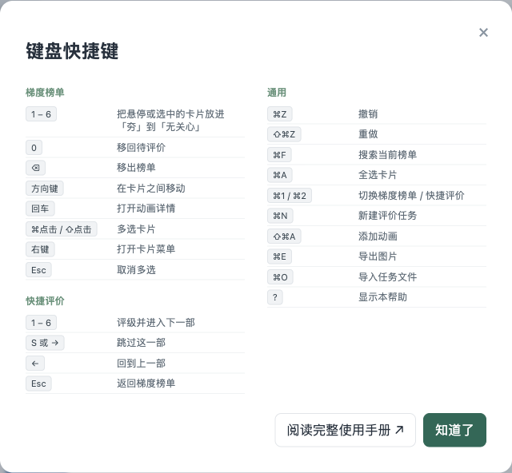

| 快捷键     | 作用                             |
| ---------- | -------------------------------- |
| ⌘N         | 新建评价任务                     |
| ⇧⌘A        | 添加动画                         |
| ⌘O         | 导入任务文件                     |
| ⇧⌘E        | 导出任务 JSON                    |
| ⌘E         | 导出图片                         |
| ⌘Z / ⇧⌘Z   | 撤销 / 重做                      |
| ⌘F         | 搜索当前榜单                     |
| ⌘A         | 全选卡片                         |
| ⌘1 / ⌘2    | 切换梯度榜单 / 快捷评价          |
| ⇧⌘L        | 显示 / 隐藏卡片名称              |
| ⌃⌘S        | 显示 / 隐藏左侧栏                |
| 1 – 6      | 给悬停或选中的卡片评级           |
| 0          | 移回待评价                       |
| ⌫          | 从榜单移除                       |
| 方向键     | 在卡片之间移动                   |
| S 或 → / ← | 快捷评价中跳过 / 回到上一部      |
| Esc        | 取消多选、清空搜索、退出快捷评价 |
| ?          | 显示快捷键                       |

---

## 常见问题

**第一次打开时提示「已损坏，无法打开」怎么办？**
这是 macOS 给从浏览器下载、且未经 Apple 公证的应用打上的隔离标记，应用本身没有坏。只需要处理一次：

1. 打开「终端」。
2. 粘贴下面这一行并回车。如果应用不在「应用程序」文件夹，把路径改成实际位置。

```sh
xattr -cr /Applications/动画梯度排行.app
```

3. 再到「应用程序」里双击打开。

**第一次打开时提示「无法打开，因为无法验证开发者」怎么办？**
这也是 macOS 对未公证软件的提醒，只需要处理一次：

1. 在「应用程序」文件夹里 **右键点击** 动画梯度排行，选择 **打开**，再在弹窗里点 **打开**。
2. 如果弹窗里没有「打开」按钮，请打开 **系统设置 → 隐私与安全性**，滚动到底部，在提到动画梯度排行的地方点 **仍要打开**。

**搜不到某部动画？**
试试原名（日文或英文），或者换一个更短的关键词。实在搜不到，可以用 [手动](#手动) 方式添加。

**封面显示不出来，只有名字？**
一般是添加时网络不好，封面没有下载下来。打开这部动画的详情，点 **编辑信息** → **从 Bangumi 重新获取**。

**没有网络能用吗？**
可以。评级、整理、导出都不需要网络，只有从 Bangumi 搜索和获取封面需要联网。没有网络时可以先手动添加。

**不小心删掉了一份榜单？**
马上按 ⌘Z，或点提示条里的 **撤销**。撤销记录在关闭软件后会清空，所以重要的榜单建议定期 [导出 JSON 备份](#备份与分享榜单文件)。

**怎么把榜单搬到另一台电脑？**
在旧电脑上导出任务 JSON，在新电脑上用 **↥ 导入任务文件** 导入。想一次搬走全部榜单，也可以直接复制 [数据文件夹](#数据保存在哪里)。

**遇到了问题或有建议？**
在菜单栏选择 **帮助 → 反馈问题**，欢迎留言。
